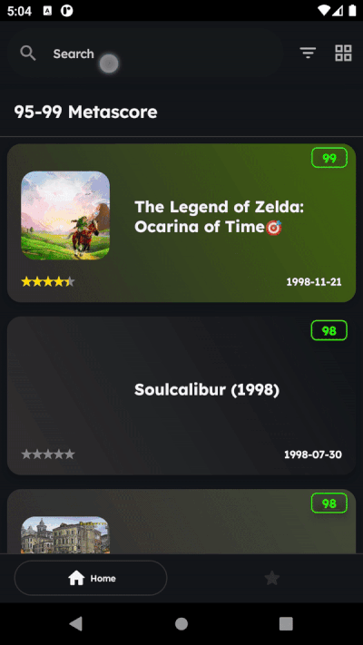
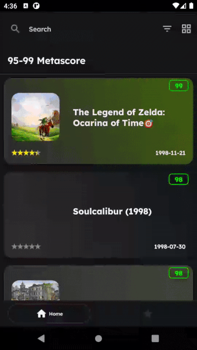

# Jetgames

## Description
Multi-module jetpack compose app that consumes data from [RAWG Video Games API](https://rawg.io/apidocs).

## Features

* Kotlin Coroutines with Flow
* MVVM Architecture
* Clean Architecture 
* Jetpack Compose
* Multi-module Architecture
* Kotlin Gradle DSL

## Prerequisite
- Api Key : You can get the key from [here](https://rawg.io/apidocs) and then put it into your `local.properties` with the key `API_KEY`.

## Screens

|                      Home Screen                        |                    Details Screen                   |
| :----------------------------------------------------:  | :-------------------------------------------------: |
|    | |

|             Screenshots Screen              |                Filter Screen                |               Favorites Screen             | 
| :-----------------------------------------: | :-----------------------------------------: |:-----------------------------------------: |                           
| |  |  | 

## Libraries

* [Navigation Component](https://developer.android.com/guide/navigation/navigation-getting-started)

* [Paging 3](https://developer.android.com/topic/libraries/architecture/paging/v3-overview)

* [LiveData](https://developer.android.com/jetpack/androidx/releases/lifecycle)

* [Dagger Hilt](https://dagger.dev/hilt/)

* [Retrofit](https://square.github.io/retrofit/)

* [Coroutines](https://github.com/Kotlin/kotlinx.coroutines)

* [Room](https://developer.android.com/training/data-storage/room)

* [Timber](https://github.com/JakeWharton/timber)

* [Coil](https://coil-kt.github.io/coil/)

* [Accompanist](https://github.com/google/accompanist)

* [Palette](https://developer.android.com/jetpack/androidx/releases/palette)

* [Lottie](https://github.com/airbnb/lottie/blob/master/android-compose.md)

* [Moshi](https://github.com/square/moshi)

* [okhttp-logging-interceptor](https://github.com/square/okhttp/blob/master/okhttp-logging-interceptor/README.md)

* [MockWebServer](https://github.com/square/okhttp/tree/master/mockwebserver)

* [Truth](https://truth.dev/)

* [MockK](https://mockk.io/ANDROID.html)

* [LeakCanary](https://square.github.io/leakcanary/)

# Module Design

| Module name        | Type                 | Description                                                      |
| -------------      | -------------        | -------------                                                    |
| [app](/app/)       | Android Application  | MainActivity, JetgamesApp, Navigation setup.                |
| [core](/core/)     | Android Library | Core business models and classes also DI modules.                                |
| [remote](/remote/) | Java/Kotlin Library  | Api factory and base mapper class for remote models.            |
| [home](/home/)     | Android Library      | UI components for the Home screen.                                      |
| [details](/details/) | Android Library    | UI components for the Details screen.                           |
| [filter](/filter/) | Android Library      | UI components for the Filter screen.                         |
| [favorites](/favorites/) | Android Library   | UI components for the Favorites screen.                         |
| [common](/common/) | Android Library      | Common stuff.                                              |
